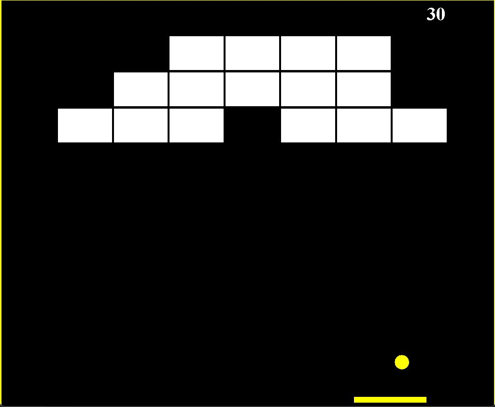

# Brick Breaker Game

A simple Brick Breaker game developed in Java using `javax.swing` and `java.awt`. This project showcases basic game development concepts and object-oriented programming in Java.

## About the Project

The Brick Breaker game was created to demonstrate the following:
- **Game Loop Implementation:** Managing game state using a timer and repaint method.
- **Collision Detection:** Handling interactions between the ball, paddle, and bricks.
- **Graphics Programming:** Using `Graphics` and `Graphics2D` for rendering game components.
- **Modularity:** Dividing the game into separate classes for better organization and maintainability.

## Game Screenshot

  
## Features
- **Interactive Gameplay:** Control the paddle with the arrow keys to prevent the ball from falling.
- **Win Condition:** Break all bricks to win the game.
- **Lose Condition:** Let the ball fall below the paddle.
- **Restart Option:** Press `Enter` to restart the game after winning or losing.
- **Score System:** Earn points by breaking bricks.

## How to Play
1. Run the program.
2. Use the following controls:
   - **Left Arrow:** Move the paddle left.
   - **Right Arrow:** Move the paddle right.
   - **Enter:** Restart the game after it ends.
3. Aim to break all bricks while ensuring the ball doesn't fall below the paddle.

### Technologies Used
- **Programming Language:** Java
- **Libraries:** 
  - `javax.swing` for GUI components.
  - `java.awt` for graphics and event handling.

## Acknowledgements
This project was inspired by classic arcade games and was built as a learning exercise in Java game development.

---

